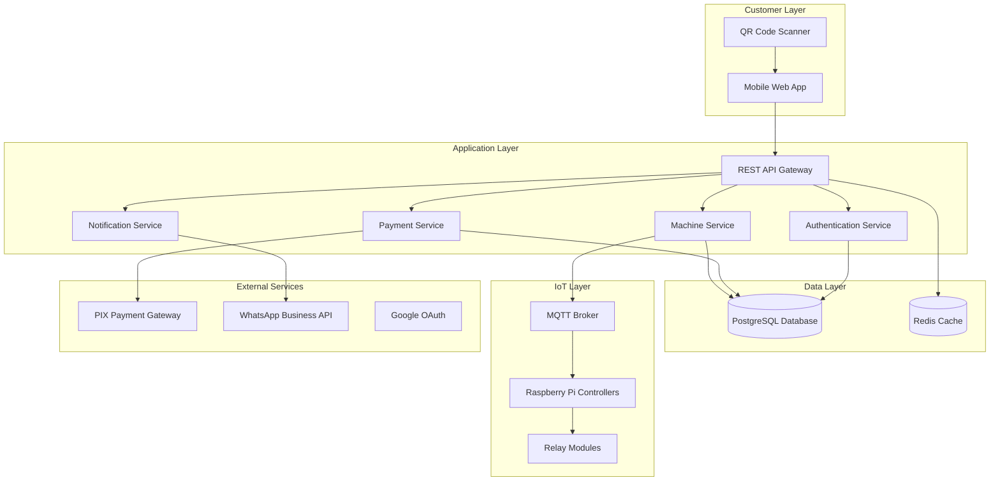

# Design Document

## Overview

The Machine Rental System is a full-stack IoT platform built with a microservices architecture to handle customer interactions, payment processing, machine control, and administrative management. The system uses a mobile-first web application for customer access, a comprehensive admin dashboard, and MQTT-based IoT communication for real-time machine control and monitoring.

## Architecture

### High-Level Architecture



### Technology Stack

**Frontend:**
- React with TypeScript for responsive web application
- Tailwind CSS for mobile-first styling
- PWA capabilities for app-like experience
- QR code scanning via browser camera API

**Backend:**
- Node.js with Express.js for REST API
- TypeScript for type safety
- JWT for authentication
- MQTT.js for IoT communication

**Database:**
- PostgreSQL for primary data storage
- Redis for session management and caching

**IoT Communication:**
- MQTT broker (Mosquitto) for real-time messaging
- Raspberry Pi with Node.js client
- GPIO control for relay module

**External Integrations:**
- PIX payment gateway (Mercado Pago or similar)
- WhatsApp Business API for notifications
- Google OAuth 2.0 for authentication

## Components and Interfaces

### Customer Interface Components

**QR Scanner Component**
- Camera access for QR code scanning
- Machine code validation
- Redirect to machine activation flow

**Machine Activation Component**
- Duration selection (1-30 minutes)
- Cost calculation display
- Payment method selection

**Payment Component**
- PIX payment integration
- Account balance usage
- Payment confirmation handling

**Account Management Component**
- Balance display and top-up
- Subscription management
- Transaction history

### Admin Dashboard Components

**Machine Registry Component**
- Machine registration form
- Location and configuration management
- QR code generation

**Monitoring Dashboard Component**
- Real-time machine status grid
- Performance metrics display
- Maintenance alerts

**Analytics Component**
- Revenue reporting
- Usage statistics
- Data export functionality

**Customer Management Component**
- Customer search and lookup
- Account balance modification
- Usage history viewing

### IoT Controller Components

**Machine Controller (Raspberry Pi)**
- MQTT client for command reception
- GPIO control for relay module
- Temperature sensor reading
- Status reporting

**Relay Control Module**
- 12V fan control via SRD-05VDC-SL-C relay
- Safety timeout mechanisms
- Power state monitoring

## Data Models

### User Model
```typescript
interface User {
  id: string;
  email: string;
  name: string;
  googleId?: string;
  passwordHash?: string;
  accountBalance: number;
  subscriptionStatus: 'none' | 'active' | 'expired';
  subscriptionExpiry?: Date;
  lastDailyUse?: Date;
  createdAt: Date;
  updatedAt: Date;
}
```

### Machine Model
```typescript
interface Machine {
  id: string;
  code: string;
  qrCode: string;
  location: string;
  controllerId: string;
  status: 'online' | 'offline' | 'maintenance' | 'in_use';
  operatingHours: {
    start: string; // HH:MM format
    end: string;   // HH:MM format
  };
  maintenanceInterval: number; // hours
  currentOperatingHours: number;
  temperature?: number;
  lastHeartbeat?: Date;
  createdAt: Date;
  updatedAt: Date;
}
```

### Usage Session Model
```typescript
interface UsageSession {
  id: string;
  userId: string;
  machineId: string;
  duration: number; // minutes
  cost: number;
  paymentMethod: 'balance' | 'pix';
  paymentId?: string;
  status: 'pending' | 'active' | 'completed' | 'failed';
  startTime?: Date;
  endTime?: Date;
  createdAt: Date;
}
```

### Transaction Model
```typescript
interface Transaction {
  id: string;
  userId: string;
  type: 'credit_added' | 'usage_payment' | 'subscription_payment';
  amount: number;
  paymentMethod: 'pix' | 'admin_credit';
  paymentId?: string;
  status: 'pending' | 'completed' | 'failed';
  createdAt: Date;
}
```

### Notification Model
```typescript
interface Notification {
  id: string;
  type: 'maintenance_required' | 'machine_offline' | 'system_error';
  machineId?: string;
  message: string;
  whatsappStatus: 'pending' | 'sent' | 'failed';
  createdAt: Date;
}
```
## Corr
ectness Properties

*A property is a characteristic or behavior that should hold true across all valid executions of a system-essentially, a formal statement about what the system should do. Properties serve as the bridge between human-readable specifications and machine-verifiable correctness guarantees.*

### Core Business Logic Properties

**Property 1: Cost calculation consistency**
*For any* usage duration between 1 and 30 minutes, the calculated cost should always equal the duration in minutes (1 R$ per minute)
**Validates: Requirements 2.2**

**Property 2: Balance deduction accuracy**
*For any* account balance and payment amount, after using balance for payment, the new balance should equal the original balance minus the payment amount
**Validates: Requirements 3.2**

**Property 3: Machine activation triggers IoT command**
*For any* successful payment and machine selection, the system should send an activation command to the corresponding machine controller
**Validates: Requirements 2.5, 12.1**

**Property 4: Subscription daily usage enforcement**
*For any* monthly subscription customer, if they have already used a machine today, attempting to activate another machine should be prevented
**Validates: Requirements 4.2, 4.3**

### Input Validation Properties

**Property 5: Invalid machine code handling**
*For any* string that is not a valid machine code, the system should return an error message and maintain current state
**Validates: Requirements 1.3**

**Property 6: Email registration validation**
*For any* email registration attempt, the system should validate email format and password requirements before account creation
**Validates: Requirements 5.2**

**Property 7: Machine registration completeness**
*For any* machine registration attempt, all required fields (location, identifier, controller assignment) must be provided and validated
**Validates: Requirements 6.1**

### State Management Properties

**Property 8: Maintenance mode prevents activation**
*For any* machine in maintenance or offline status, customer activation attempts should be prevented and status should be displayed
**Validates: Requirements 1.4, 7.3**

**Property 9: Operating hours enforcement**
*For any* machine with configured operating hours, activation attempts outside the specified time range should be prevented
**Validates: Requirements 8.1, 8.4**

**Property 10: Automatic maintenance triggering**
*For any* machine that reaches its configured maintenance interval hours, the system should automatically set it to maintenance mode
**Validates: Requirements 7.2, 8.2**

### Payment and Balance Properties

**Property 11: Payment option availability**
*For any* customer with account balance greater than or equal to the cost, both balance payment and PIX payment options should be offered
**Validates: Requirements 2.3**

**Property 12: Shortfall calculation accuracy**
*For any* customer with insufficient account balance, the displayed shortfall amount should equal the cost minus the current balance
**Validates: Requirements 2.4, 3.4**

**Property 13: Credit addition immediacy**
*For any* successful credit addition, the account balance should be updated immediately after payment confirmation
**Validates: Requirements 3.1, 11.2**

### Authentication and Authorization Properties

**Property 14: Session state maintenance**
*For any* successful login, the system should maintain session state and allow access to protected features
**Validates: Requirements 5.3**

**Property 15: Protected feature authorization**
*For any* protected feature access attempt, the system should verify authentication status before allowing access
**Validates: Requirements 5.5**

**Property 16: Authentication failure handling**
*For any* failed authentication attempt, appropriate error messages should be displayed without revealing system details
**Validates: Requirements 5.4**

### IoT Communication Properties

**Property 17: Relay control duration accuracy**
*For any* machine activation command with specified duration, the relay should remain engaged for exactly that duration
**Validates: Requirements 12.2**

**Property 18: Automatic session termination**
*For any* active usage session, when the duration expires, the machine controller should automatically disengage the relay and report completion
**Validates: Requirements 12.3**

**Property 19: Communication failure detection**
*For any* machine controller that stops responding, the system should mark it as offline and prevent new activations
**Validates: Requirements 7.5, 12.5**

### Notification Properties

**Property 20: Maintenance notification triggering**
*For any* machine that enters maintenance mode, a WhatsApp notification should be sent to the administrator
**Validates: Requirements 10.1**

**Property 21: Offline notification triggering**
*For any* machine that goes offline unexpectedly, an immediate WhatsApp notification should be sent to the administrator
**Validates: Requirements 10.2**

**Property 22: Notification rate limiting**
*For any* sequence of rapid notifications, the system should implement rate limiting to prevent notification spam
**Validates: Requirements 10.5**

### Data Display Properties

**Property 23: Currency formatting consistency**
*For any* account balance amount, the display should show the value in proper Brazilian Real currency format
**Validates: Requirements 3.3**

**Property 24: Dashboard metrics accuracy**
*For any* dashboard access, the displayed totals (machines, operational count, maintenance count, revenue) should accurately reflect current system state
**Validates: Requirements 9.1**

**Property 25: Usage history completeness**
*For any* usage history display, each entry should contain customer name, machine used, activation time, duration, and payment method
**Validates: Requirements 11.3**

## Error Handling

### Payment Processing Errors
- PIX payment failures should be logged and user notified with retry options
- Network timeouts during payment should maintain transaction state for recovery
- Duplicate payment attempts should be detected and prevented

### IoT Communication Errors
- Machine controller disconnections should trigger automatic offline status
- Command delivery failures should be retried with exponential backoff
- Hardware sensor errors should be logged without affecting core functionality

### Authentication Errors
- Invalid credentials should return generic error messages
- Session expiration should redirect to login with clear messaging
- OAuth failures should provide fallback to email authentication

### Data Validation Errors
- Invalid input should be rejected with specific field-level error messages
- Database constraint violations should be handled gracefully
- Concurrent modification conflicts should be resolved with user notification

## Testing Strategy

### Unit Testing Approach
The system will use Jest for unit testing with the following focus areas:
- Business logic functions (cost calculation, balance management)
- Input validation and sanitization
- Error handling and edge cases
- API endpoint behavior
- Database operations

### Property-Based Testing Approach
The system will use fast-check for property-based testing to verify universal properties:
- Each property-based test will run a minimum of 100 iterations
- Tests will use smart generators that constrain inputs to valid ranges
- Each test will be tagged with comments referencing the specific correctness property
- Property tests will complement unit tests by verifying behavior across all valid inputs

**Property-Based Testing Requirements:**
- Use fast-check library for JavaScript/TypeScript property-based testing
- Configure each test to run minimum 100 iterations for thorough coverage
- Tag each test with format: `**Feature: machine-rental-system, Property {number}: {property_text}**`
- Generate realistic test data that respects business constraints (e.g., duration 1-30 minutes)
- Focus on testing universal properties rather than specific examples

### Integration Testing
- API endpoint integration with database operations
- Payment gateway integration testing with mock services
- IoT communication testing with simulated hardware
- Real-time notification delivery testing

### End-to-End Testing
- Complete customer journey from QR scan to machine activation
- Admin workflow testing for machine management
- Subscription lifecycle testing
- Error recovery scenarios